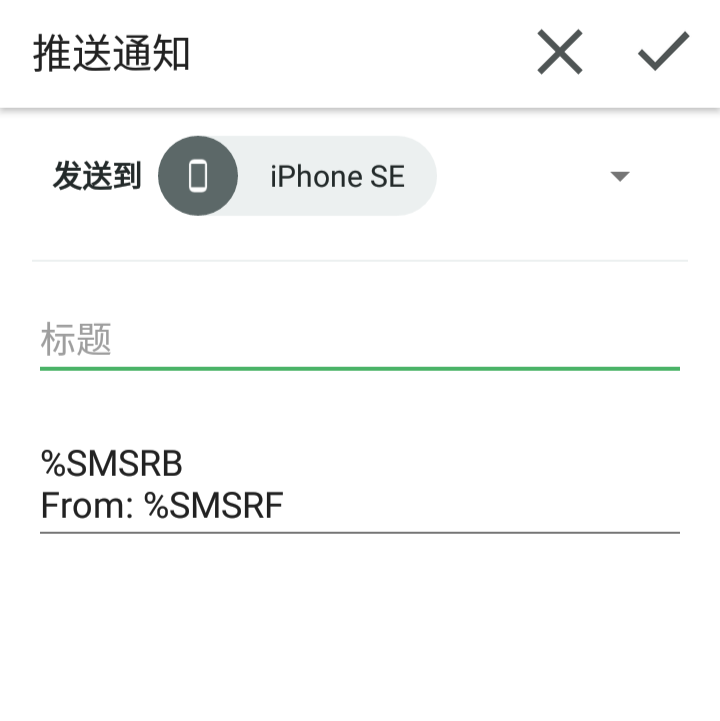
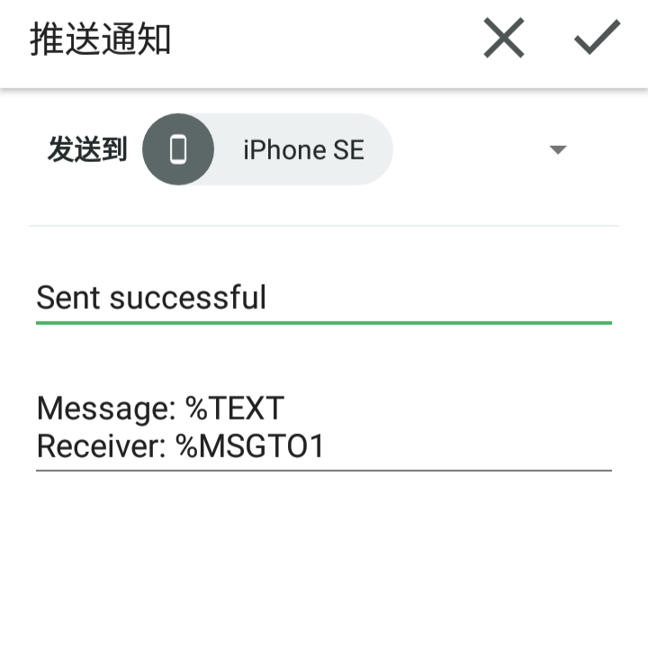
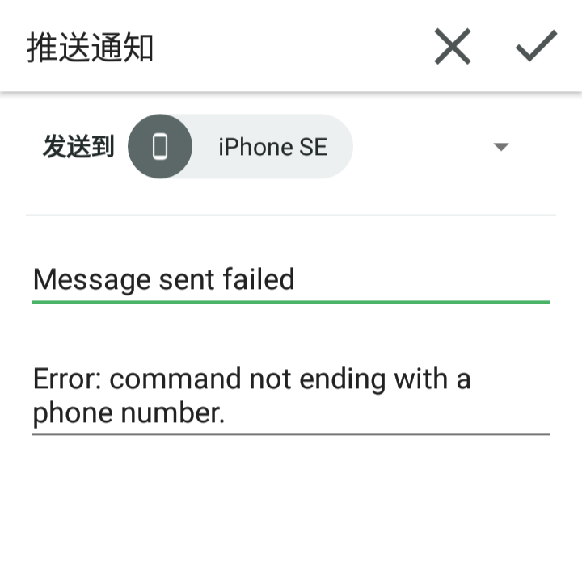

三个Pushbullet与Tasker整合的自动化配置

### 运行环境

Android备机：```Tasker```**(电话、短信、后台权限)** ```Pushbullet```**（开启自动复制链接和记事功能）**  ```科学上网```

另一台手机：```Pushbullet``` ```科学上网```

# 未接来电转发

能连通Pushbullet时则通过Pushbullet，不能连通时则通过短信将未接来电号码发送至另一台手机

### prf.xml下载

https://raw.githubusercontent.com/feeshy/tasker_profiles_share/master/Pushbullet_Intergrated/未接来电.prf.xml

### 故障排除

导入后如果只能以短信方式转发，请检查自己是否科学上网

如两种方式都不转发请重新配置Pushbullet

    %CNUM
    未接来电


# 短信转发

之前制作的[离线转发](https://github.com/feeshy/tasker_profiles_share/tree/master/Offline_SMS_Forward)的强化版，能连通Pushbullet时则通过其转发，不能连通时则回落为短信转发。支持上下文的回复、转发命令。

回复语法

    re: 回复的内容

转发语法（仅支持短信命令，如需通过Pushbullet转发，请复制消息后使用[远程短信](#远程短信)命令）

    fw: 转发的号码

### prf.xml下载

https://raw.githubusercontent.com/feeshy/tasker_profiles_share/master/Pushbullet_Intergrated/SMS转发.prf.xml

👆导入后请将所有```13800100500```换成自己**另一台手机**的号码 ~~而**不是**安装Tasker的手机的号码~~

https://raw.githubusercontent.com/feeshy/tasker_profiles_share/master/Pushbullet_Intergrated/SMS转发_回复.prf.xml

### 故障排除

如果只能以短信方式转发，请检查自己是否科学上网

如两种方式都不转发请重新配置Pushbullet

    %SMSRB
    来自 %SMSRF



# 远程短信

Pushbullet提供通过PC或者平板控制安卓手机发短信的功能，但你无法用一台手机控制另一台手机发送短信。这个profile意图补齐此需求。

语法

    msg: 短信内容 接收号码

Android备机将在发送成功后推送一条消息作为反馈

### prf.xml下载

https://raw.githubusercontent.com/feeshy/tasker_profiles_share/master/Pushbullet_Intergrated/云短信.prf.xml

### 故障排除

导入后如果只能以短信方式转发，请检查自己是否科学上网

如两种方式都不转发请重新配置Pushbullet

    发送成功
    信息：%TEXT
    收件人：%MSGTO01



    发送失败
    命令应以电话号码结尾


