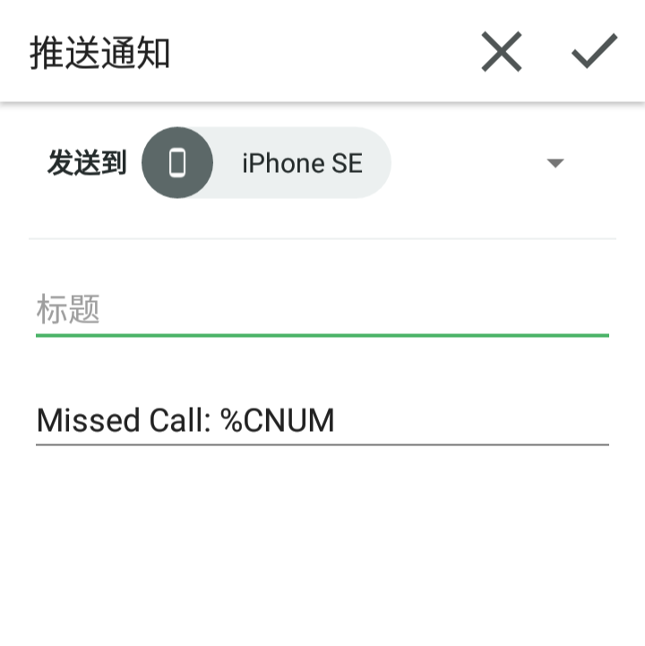

[^1]: import from [github](未接来电.prf.xml)
[^2]: import from [github](SMS转发.prf.xml)
[^3]: import from [github](云短信.prf.xml)

三个Pushbullet与Tasker整合的自动化配置

运行环境

- Android备机：```Tasker```**(电话、短信、后台权限)** ```Pushbullet```**（开启自动复制链接和记事功能）**  ```科学上网```
- 另一台手机：```Pushbullet``` ```科学上网```

## 未接来电转发

能连通Pushbullet时则通过Pushbullet，不能连通时则通过短信将未接来电号码发送至另一台手机

👇无论自己配置还是导入xml[^1]，请将所有```13800100500```换成自己**另一台手机**的号码 ~~注意**不是**安装Tasker的手机的号码~~

```
Profile: 未接来电
	Event: Missed Call [ Caller:* ]
Enter: 未接来电
	A1: HTTP Request [  Method:HEAD URL:https://www.pushbullet.com Headers: Query Parameters: Body: File To Send: File To Save With Output: Timeout (Seconds):10 Trust Any Certificate:Off Continue Task After Error:On ] 
	A2: If [ %http_response_code ~ 200 ]
		A3: Pushbullet [ Configuration:Push a note titled "" with the message "Missed Call: %CNUM". Timeout (Seconds):15 ] 
	A4: Else 
		A5: Send SMS [ Number:13800100500 Message:Missed call: %CNUM Store In Messaging App:On SIM Card: ] 
	A6: End If 
```

导入后如果只能以短信方式转发，请检查自己是否科学上网

如两种方式都不转发请重新配置该Tasker任务的第3个动作



## 短信转发

之前制作的[离线转发](https://github.com/feeshy/tasker_profiles_share/tree/master/Offline_SMS_Forward)的强化版，能连通Pushbullet时则通过其转发，不能连通时则回落为短信转发。支持上下文的回复、转发命令。

回复语法

    re: 回复的内容

转发语法（仅支持短信命令，如需通过Pushbullet转发，请复制消息后使用[远程短信](#远程短信)命令）

    fw: 转发的号码

👇无论自己配置还是导入xml[^2]，请将所有```13800100500```换成自己**另一台手机**的号码 ~~注意**不是**安装Tasker的手机的号码~~

```
Profile: SMS转发
	Event: Received Text [ Type:SMS Sender:* Content:* ]
Enter: SMS转发
	<CHECK SPAM>
	A1: If [ %SMSRF !~R ^\+?(86)?(1[3-9][0-9])\d{8}$ & %SMSRB ~R (退订|回复?)(TD?|N|QX|BK) |+ %SMSRB ~R (薇|威|V|W)(信|X) |+ %SMSRB ~R 福利|贷|信用卡|澳门|在家就能 ]
		A2: Stop [ With Error:Off Task: ] 
	<FORWARD>
	A3: Else If [ %SMSRF !~R 13800100500 ]
		A4: HTTP Request [  Method:HEAD URL:www.pushbullet.com Headers: Query Parameters: Body: File To Send: File To Save With Output: Timeout (Seconds):10 Trust Any Certificate:Off Continue Task After Error:On ] 
		A5: If [ %http_response_code ~ 200 ]
			A6: Pushbullet [ Configuration:Push a note titled "" with the message "%SMSRB From: %SMSRF" Timeout (Seconds):15 ] 
			A7: Profile Status [ Name:SMS转发-回复 Set:On ] 
		A8: Else 
			A9: Send SMS [ Number:13800100500 Message:%SMSRB From: %SMSRF Store In Messaging App:Off SIM Card: ] 
			A10: Variable Set [ Name:%SMSST To:%SMSRF Recurse Variables:Off Do Maths:Off Append:Off Max Rounding Digits:3 ] 
			A11: Variable Set [ Name:%SMSSB To:%SMSRB Recurse Variables:Off Do Maths:Off Append:Off Max Rounding Digits:3 ] 
		A12: End If 
	<REMOTE COMMAND>
	A13: Else If [ %SMSRF ~R 13800100500 ]
		<REPLY>
		A14: If [ %SMSRB ~R ^(?i)re:\s*[\s\S]*$ ]
			A15: Variable Set [ Name:%SMSSB To:%SMSRB Recurse Variables:Off Do Maths:Off Append:Off Max Rounding Digits:3 ] 
			A16: Variable Search Replace [ Variable:%SMSSB Search:^(?i)re:\s* Ignore Case:Off Multi-Line:Off One Match Only:Off Store Matches In Array: Replace Matches:On Replace With: ] 
			A17: Send SMS [ Number:%SMSST Message:%SMSSB Store In Messaging App:Off SIM Card: ] 
		<FORWARD>
		A18: Else If [ %SMSRB ~R ^(?i)fw:\s*[0-9]*$ ]
			A19: Variable Set [ Name:%SMSST To:%SMSRB Recurse Variables:Off Do Maths:Off Append:Off Max Rounding Digits:3 ] 
			A20: Variable Search Replace [ Variable:%SMSST Search:^(?i)fw:\s* Ignore Case:Off Multi-Line:Off One Match Only:Off Store Matches In Array: Replace Matches:On Replace With: ] 
			A21: Send SMS [ Number:%SMSST Message:%SMSSB Store In Messaging App:Off SIM Card: ] 
		<OTHER>
		A22: Else 
			A23: Goto [ Type:Action Label Number:1 Label:CLEAR ] 
		A24: End If 
		<CLEAR>
		A25: Variable Clear [ Name:%SMSST Pattern Matching:Off Local Variables Only:Off ] 
		A26: Variable Clear [ Name:%SMSSB Pattern Matching:Off Local Variables Only:Off ] 
	A27: End If
```
```
Profile: SMS转发-回复
	Event: 收到推送 [ Configuration:如果我收到 note 包含以下文本 "re:" 来自 我自己. ]
Enter: SMS转发-回复
	A1: Variable Set [ Name:%TEXT To:%CLIP Recurse Variables:Off Do Maths:Off Append:Off Max Rounding Digits:3 ] 
	A2: Variable Search Replace [ Variable:%TEXT Search:^re:\s* Ignore Case:On Multi-Line:Off One Match Only:Off Store Matches In Array: Replace Matches:On Replace With: ] 
	A3: Send SMS [ Number:%SMSRF Message:%SMSSB Store In Messaging App:Off SIM Card: ] 
	A4: Variable Clear [ Name:%TEXT Pattern Matching:Off Local Variables Only:Off ] 
	A5: Profile Status [ Name:SMS转发-回复 Set:Off ] 
```

如果只能以短信方式转发，请检查自己是否科学上网

如两种方式都不转发请重新配置该Tasker任务的第6个动作


## 远程短信

Pushbullet提供通过PC或者平板遥控安卓手机发短信的功能，但你无法用一台手机遥控另一台手机发送短信。这个profile意图补齐此需求。

语法

    msg: 短信内容 接收号码

Android备机将在发送成功后推送一条消息作为反馈

```
Profile: 云短信
	Event: 收到推送 [ Configuration:如果我收到 note 包含以下文本 "msg:" 来自 我自己. ]
Enter: 云短信
	A1: If [ %CLIP ~R [0-9]+$ ]
		A2: Variable Set [ Name:%TEXT To:%CLIP Recurse Variables:Off Do Maths:Off Append:Off Max Rounding Digits:3 ] 
		A3: Variable Search Replace [ Variable:%TEXT Search:^msg:\s* Ignore Case:On Multi-Line:Off One Match Only:On Store Matches In Array: Replace Matches:On Replace With: ] 
		A4: Variable Search Replace [ Variable:%TEXT Search:[0-9]+$ Ignore Case:On Multi-Line:Off One Match Only:On Store Matches In Array:%MSGTO Replace Matches:On Replace With: ] 
		A5: Send SMS [ Number:%MSGTO1 Message:%TEXT Store In Messaging App:Off SIM Card: ] 
		A6: Pushbullet [ Configuration:Push a note titled "Sent successful" with the message "Message: %TEXT To: %MSGTO01" Timeout (Seconds):15 ] 
		A7: Variable Clear [ Name:%TEXT Pattern Matching:Off Local Variables Only:Off ] 
		A8: Variable Clear [ Name:%MSGTO Pattern Matching:Off Local Variables Only:Off ] 
	A9: Else 
		A10: Pushbullet [ Configuration:Push a note titled "Message sent failed" with the message "Error: Command not ending with phone number." Timeout (Seconds):15 ] 
	A11: End If 
```

导入[^3]后如果只能以短信方式转发，请检查自己是否科学上网

如两种方式都不转发请重新配置该Tasker任务

第6个动作


第10个动作


